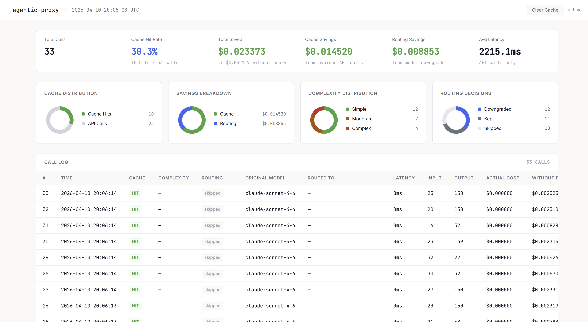

# agentic-proxy


A lightweight, drop-in proxy for the Anthropic API that reduces token usage and cost for AI agents — with zero changes to your agent code.



---

## What it does

When you build an agent using the Anthropic API, every call costs tokens. Repeated calls, over-specified models, and bloated context all add up. `agentic-proxy` sits between your agent and the Anthropic API and optimizes each request transparently:

- **Caching** — identical requests are served from a local cache instead of hitting the API. Cache hits cost nothing.
- **Model routing** — each prompt is classified as simple, moderate, or complex. Simple prompts are automatically downgraded to a cheaper model (Haiku) instead of burning Sonnet or Opus.
- **Live dashboard** — a real-time view of every call, token usage, cost, cache hit rate, and savings broken down by module — across sessions.

Your agent makes the same API calls it always did. It just points at `localhost:8000` instead of `api.anthropic.com`.

---

## How it works

```
Agent → agentic-proxy → Anthropic API
              ↓
    [cache check]         → cache hit: return immediately, $0 cost
    [model router]        → classify prompt, downgrade model if appropriate
    [forward request]     → send to Anthropic, stream response back
    [store in cache]      → save for future identical requests
    [log]                 → record tokens, cost, latency, routing decision
```

All of this is transparent to the agent. It sends a request and gets a response back — it has no idea any of this happened.

---

## Quickstart

### 1. Clone and install

```bash
git clone https://github.com/yourname/agentic-proxy.git
cd agentic-proxy
python -m venv venv
source venv/bin/activate  # Windows: venv\Scripts\activate
pip install -r requirements.txt
```

### 2. Configure

```bash
cp .env.example .env
```

Open `.env` and add your Anthropic API key:

```
ANTHROPIC_API_KEY=your_api_key_here
```

### 3. Start the proxy

```bash
python main.py
```

The proxy starts on `http://localhost:8000`.

### 4. Point your agent at the proxy

The only change you need to make to your agent is the base URL:

```python
import anthropic

client = anthropic.Anthropic(
    api_key="any-value",   # proxy handles auth from your .env
    base_url="http://localhost:8000"
)
```

That's it. All your existing agent code works unchanged.

### 5. Open the dashboard

While the proxy is running, open:

```
http://localhost:8000/dashboard
```

You'll see live stats, cache hit rate, cost savings, complexity distribution, and a full call log — updated every 2 seconds.

---

## Configuration

All settings are controlled via `.env`. Copy `.env.example` to get started.

| Variable | Default | Description |
|---|---|---|
| `ANTHROPIC_API_KEY` | — | **Required.** Your Anthropic API key. |
| `CACHE_ENABLED` | `true` | Enable or disable the cache module. |
| `ROUTER_ENABLED` | `true` | Enable or disable model routing. |
| `LOGGER_ENABLED` | `true` | Enable or disable the session logger. |
| `CACHE_TTL_HOURS` | `24` | How long cache entries live before expiring. |
| `CACHE_MAX_ENTRIES` | `1000` | Maximum cache entries before LRU eviction kicks in. |

---

## Modules

### Cache

Stores responses in a local SQLite database keyed by a SHA-256 hash of the full request body. On a cache hit the response is returned immediately with no API call.

- **TTL expiry** — entries expire after `CACHE_TTL_HOURS` hours
- **LRU eviction** — when the cache hits `CACHE_MAX_ENTRIES`, the least recently used entries are evicted first
- **Streaming support** — cached responses are replayed as proper SSE events so streaming agents receive a correctly formatted stream

### Model Router

Before forwarding a request, the router sends the prompt to a Haiku classifier that returns one of three complexity tiers:

| Tier | Examples | Model |
|---|---|---|
| `SIMPLE` | Summarize, translate, format, extract | `claude-haiku-4-5` |
| `MODERATE` | Write, explain, review, general coding | `claude-sonnet-4-6` |
| `COMPLEX` | Debug, architect, deep reasoning | `claude-opus-4-6` |

The router only downgrades — it never upgrades a model beyond what your agent specified. If your agent already uses Haiku, routing is skipped entirely.

The classifier prompt is truncated to 500 characters before being sent to keep classification cost minimal.

### Logger

Every request is logged to SQLite with:

- Timestamp, cache hit/miss, complexity, routing decision
- Input/output token counts
- Actual cost vs what it would have cost without the proxy
- API latency and router latency

Logs persist across server restarts. The dashboard lets you view individual sessions or aggregate everything under **Overall**.

---

## Streaming

`agentic-proxy` fully supports streaming requests (`stream: true`). Chunks are forwarded to the agent immediately as they arrive — the proxy buffers in the background to cache and log the response after the stream completes.

Cache hits for streaming requests are replayed as proper SSE events so the agent receives a correctly formatted stream regardless of whether the response came from cache or the API.

---

## Dashboard

Open `http://localhost:8000/dashboard` while the proxy is running.

**Summary stats**
- Total calls, cache hit rate, API calls
- Total saved, cache savings, routing savings
- Average API latency, average router latency
- Current cache size vs maximum

**Charts**
- Cache distribution (hits vs misses)
- Savings breakdown (cache savings vs routing savings)
- Complexity distribution (simple / moderate / complex)
- Routing decisions (downgraded / kept / skipped)

**Call log**
Every request with full detail — model, routing decision, complexity, latency, cost, and per-call savings.

**Session selector**
Switch between individual sessions or view aggregated stats across all sessions under Overall.

**Clear cache**
A button in the topbar wipes the cache without restarting the server.

---

## Project structure

```
agentic-proxy/
├── main.py           # FastAPI app, routes
├── proxy.py          # Forwards requests to Anthropic, handles streaming
├── pipeline.py       # Orchestrates modules in order per request
├── config.py         # Loads and validates settings from .env
├── requirements.txt
├── .env.example
├── modules/
│   ├── cache.py      # SQLite cache with TTL and LRU eviction
│   ├── router.py     # Prompt classifier and model routing
│   ├── logger.py     # Persistent session log and stats
│   └── dashboard.py  # Live HTML dashboard
└── demo/
    ├── agent.py           # Standard demo agent (non-streaming)
    └── streaming_agent.py # Streaming demo agent
```

---

## Running the demo agents

Make sure the proxy is running first, then in a separate terminal:

```bash
# Standard agent — 43 calls with a mix of simple, moderate, complex, and duplicate prompts
python demo/agent.py

# Streaming agent — demonstrates streaming support and cache replay
python demo/streaming_agent.py
```

---

## Known limitations

- **Router accuracy** — the classifier is good but not perfect. A misclassified prompt may be downgraded to a model that produces a lower quality response. You can set `ROUTER_ENABLED=false` in `.env` to disable routing if reliability is a concern.
- **Router overhead** — every non-cached request incurs a small Haiku call to classify the prompt. This is visible in the dashboard as router latency. For very short-lived agents this overhead may outweigh the routing savings.
- **Single instance** — the proxy is designed to run locally for a single developer. It is not designed for multi-user or production deployments.
- **In-memory session ID** — the current session ID resets on server restart, though all logged data persists in SQLite.

---

## Planned improvements

- [ ] Semantic caching — cache near-identical prompts using embedding similarity, not just exact match
- [ ] Context trimming — summarize and compress long conversation histories before forwarding
- [ ] Router confidence threshold — only downgrade when the classifier is above a configurable confidence level
- [ ] Docker support — single command setup with `docker-compose up`

---

## License

MIT